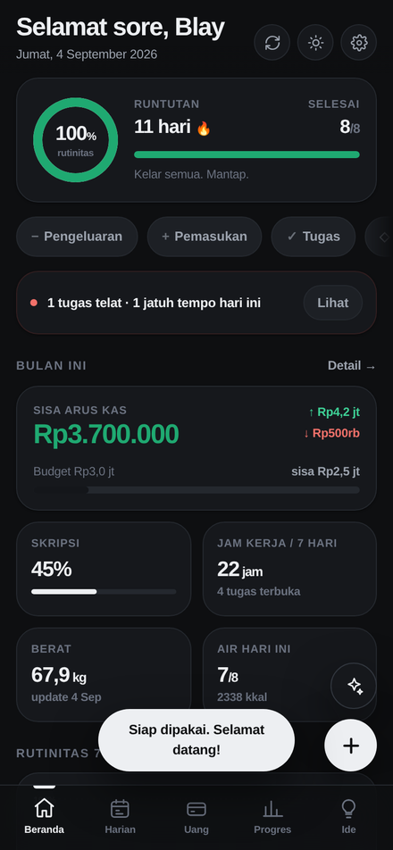
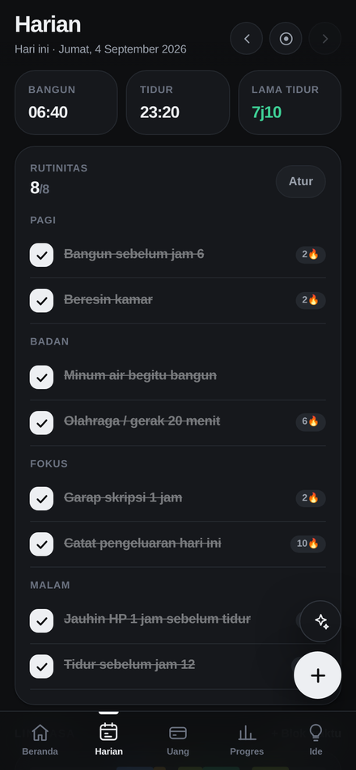
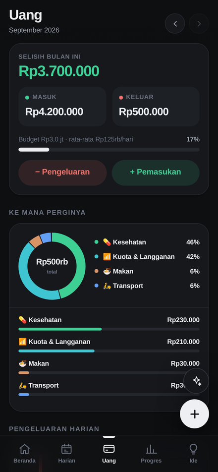
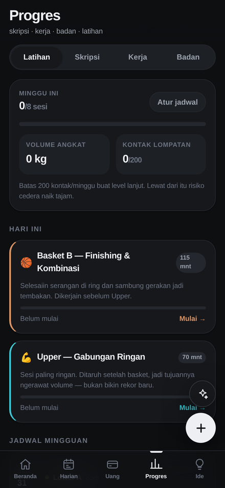
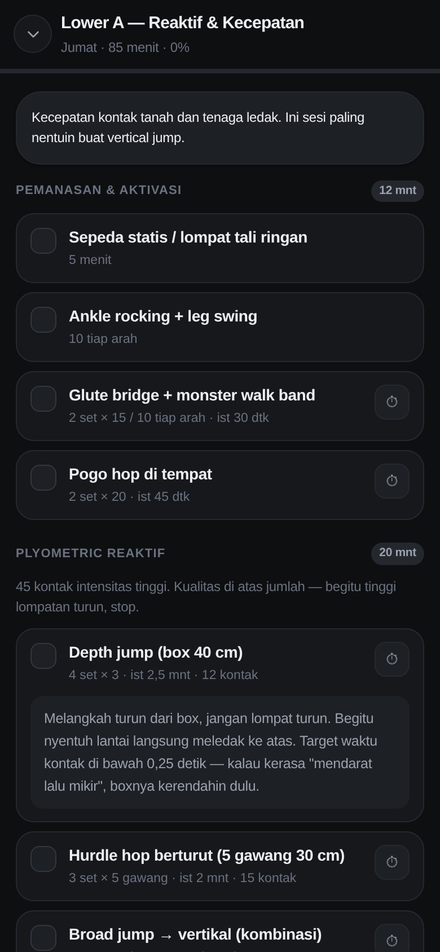
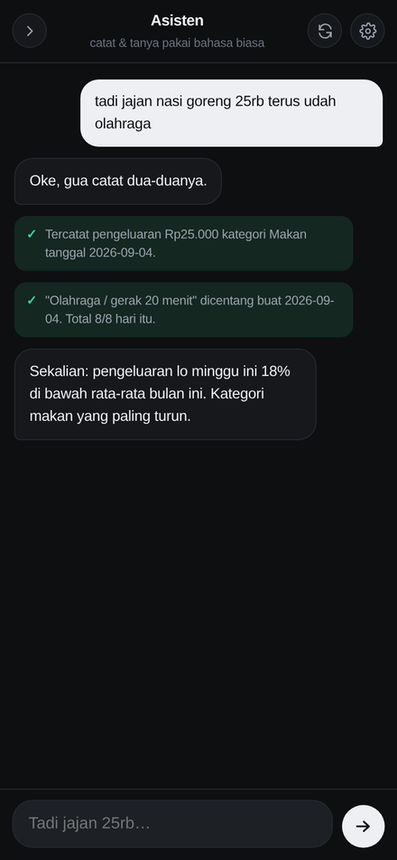
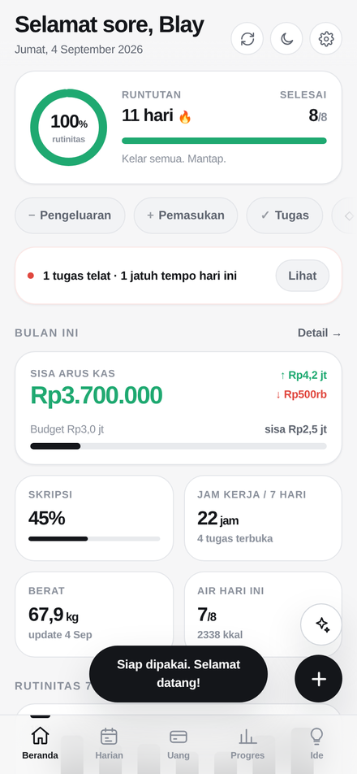
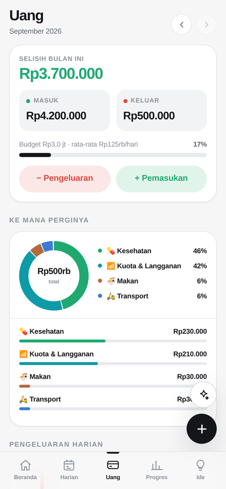
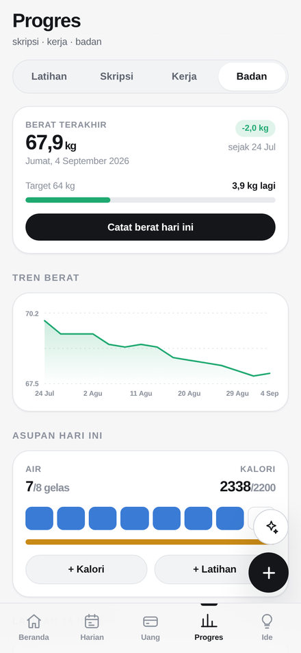
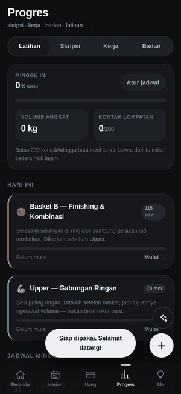

# Rutin

**A personal life tracker built to solve my own problem.** Daily activity from waking to sleeping, money in and out, thesis progress, work, body, a strength-and-basketball training program, and content ideas — in one app.

One HTML file, zero client dependencies, wrapped into an Android app. It works fully offline and has a Claude assistant inside that logs and edits your data from plain sentences — from the chat panel, or by replying to a notification without opening the app.

[](https://github.com/GITHUB-USERNAME/rutin/actions/workflows/ci.yml)
[](https://GITHUB-USERNAME.github.io/rutin/)
[](https://github.com/GITHUB-USERNAME/rutin/releases/latest)
[](LICENSE)

---

## Try it in 10 seconds

**→ [Open the live demo](https://GITHUB-USERNAME.github.io/rutin/)** — works on phone and desktop, nothing to install.

On the welcome screen, tap **"Pakai di HP ini dulu"** (use on this device) to skip setup. Everything runs locally in your browser; no account, no server, nothing leaves your device.

For the real thing on Android: **[download the APK](https://github.com/GITHUB-USERNAME/rutin/releases/latest)** — 3.2 MB, Android 6.0+.

---

## What it looks like

| Home | Daily log | Money |
|---|---|---|
|  |  |  |

| Training | Live session | Assistant |
|---|---|---|
|  |  |  |

<details>
<summary>Light theme</summary>

| Home | Money | Body |
|---|---|---|
|  |  |  |

</details>

### Running a training session



Check off exercises without losing your scroll position, read the technique cue for each movement, start the rest timer the program prescribes, and log weight × reps per set. When the session ends it writes itself into the daily timeline and the body log, so nothing gets recorded twice.

---

## Why I built it

I was tracking my life across four places: a notes app for the daily stuff, a spreadsheet for money, a group chat with my thesis advisor, and nothing at all for training. Every one of them worked. Together they were useless, because the question I actually wanted answered lived between them:

> *Do the weeks where I train consistently line up with the weeks I make progress on my thesis — or do they compete for the same energy?*

No single tool could answer that, because no single tool had all the data. So I built one that does.

The training module exists because I play basketball and I'm chasing a higher vertical jump. That turned out to be the most interesting part to build: it's the only module with real domain knowledge baked in, and the only one where getting the numbers wrong could actually hurt me.

---

## What it does

**Home** — today's routine ring, streak, this month's cash flow against budget, thesis percentage, work hours, weight, water. Below that: every deadline from every module merged into one sorted list, and a four-month consistency heatmap.

**Daily** — wake and sleep times with sleep duration calculated automatically (including across midnight), a routine checklist grouped into morning / body / focus / night with a per-item streak, a 24-hour timeline of what you actually did, mood, energy, and a free note.

**Money** — income and expenses across 14 categories, monthly budget, a "where it went" donut, daily spend chart, and history grouped by date.

**Progress** — four sections:
- *Training* — the weekly gym and basketball schedule, live session mode, lift volume, and a jump-contact counter
- *Thesis* — per-chapter progress with status and deadlines, a countdown to the defense, weekly writing time pulled from the daily timeline, and advisor meeting notes
- *Work* — tasks with priority and due dates, work-hour logging, per-project breakdown
- *Body* — weight trend, water and calories, workout log, a 14-day sleep chart, and habit heatmaps

**Ideas** — a content idea vault with hooks, concepts, platforms, tags, and a five-stage pipeline from raw idea to published.

**Assistant** — write `tadi jajan nasi goreng 25rb terus udah olahraga` ("grabbed fried rice for 25k and already worked out") and it records the expense and ticks the workout routine in one go. Every action it takes shows up as a green checked line so you can catch it if it puts something in the wrong place. It can also answer questions about your own data. 19 tools, all running locally against your state.

Full inventory: **[docs/FEATURES.md](docs/FEATURES.md)**

---

## The training program

The most opinionated part of the app. Five gym sessions and two to three basketball sessions a week, designed to raise vertical jump.

| Day | Session | Duration |
|---|---|---|
| Mon | Lower A — Reactive & Speed | 85 min |
| Tue | Basketball A (shooting & handling) → Push | 110 + 75 min |
| Wed | Pull | 75 min |
| Thu | Lower B — Strength & Power | 88 min |
| Fri | Basketball B (finishing & combos) → Upper | 115 + 70 min |
| Sat | Basketball C — shooting volume (optional) | 80 min |
| Sun | Full rest | — |

Four rules are enforced **by the test suite**, not just written in a doc:

1. Gym sessions stay under 90 minutes, basketball under 120
2. Every block's minutes must sum exactly to the session duration
3. Lower-body days are never scheduled alongside basketball
4. High-intensity jump contacts stay under 200 per week

That last one matters most. Published guidance puts the ceiling for advanced athletes at 150–200 ground contacts per week, and exceeding it raises injury risk sharply. The app counts contacts from sessions you actually logged and warns you as you approach the limit. The default program uses 100 of the 200, leaving room for pickup games.

If any rule breaks, `npm test` fails. Those rules are the reason the program is safe, so they belong in the tests.

Full program with every exercise, set, rep, and technique cue: **[docs/TRAINING-PROGRAM.md](docs/TRAINING-PROGRAM.md)**

---

## How it's built

```
src/            11 files, concatenated in numeric order by build.mjs
tests/          6 specs, 192 assertions through a real browser
tools/          icon generator, Android packaging, screenshots, dev server
docs/           architecture, features, limitations, roadmap, setup guides
```

**One HTML file, no framework.** The output has to run from anywhere — bundled inside an APK, served from static hosting, or double-clicked from a folder. No transpile step, no client-side `node_modules`, nothing that breaks when a bundler changes major versions. The source is split for sanity; `build.mjs` joins it and validates the result.

**Charts are hand-drawn SVG.** Six small functions instead of a charting library. They match the design system exactly and work offline with no CDN.

**Storage is two-layered.** `localStorage` is written synchronously on every change, so if Android kills the app a second later the data is already on disk. IndexedDB is written right after and holds more. On boot, whichever copy has the newer timestamp wins. Every storage call is wrapped — private mode and blocked-storage settings must not break the app.

**Cloud sync is optional.** One Supabase table, one row per user, row-level security so the public key is safe to ship in the app. Skip it and everything still works.

**Native bridge is isolated.** One file wraps everything Capacitor-specific — status bar, notifications, back button, and routing the Anthropic API call through native HTTP to sidestep CORS in the Android WebView. The rest of the code doesn't know it's in an app.

**Reminders are two-way.** Agenda entries, the morning and evening nudges, and the gym rest timer all schedule real Android notifications, and the first two accept a typed reply straight from the lock screen. A small local parser turns `25rb makan`, `2 gelas` or `berat 67` into records with no network and no API key; anything it doesn't recognise lands in today's note rather than being dropped. Every such write offers an undo, because you never saw a form.

**The Anthropic key can stay off the device.** `supabase/functions/asisten` is a thin authenticated proxy: it verifies your Supabase session, forwards only `/v1/messages` and `/v1/models`, caps the body, and enforces a daily per-user quota. Deploy it and the app authenticates with its own session token instead of holding a key. Setup: **[docs/SUPABASE.md](docs/SUPABASE.md)**

Full write-up with the data model, render pipeline, sync protocol, and assistant tool loop: **[docs/ARCHITECTURE.md](docs/ARCHITECTURE.md)**

---

## Testing

192 assertions across 6 specs, driving a real browser at phone viewport.

```
✓ Core — dates, currency, streaks, storage           29/29
✓ Modules — five screens through the real UI         29/29
✓ Training — program rules, session mode, timer      66/66
✓ Assistant — tool executors, tool-use loop, errors  25/25
✓ Native — notifications, back button, HTTP          24/24
✓ Durability — IndexedDB, recovery, backup, sync     19/19
```

The tests drive the UI the way a person does — filling forms, tapping chips, pressing save. That catches things a unit test misses: if a category chip stops writing to its hidden input, the test fails, while a unit test of `catOf()` would still pass.

**They earned their keep immediately.** The first full run caught two bugs that had been shipping silently:

1. `kontakMinggu()` counted jump contacts from the *schedule* instead of from sessions actually logged. Move Lower A from Monday to Tuesday and its 57 contacts vanished from the count — from the exact counter that exists to prevent injury.
2. `S.latihan` stayed `null` until the training tab was opened, so any backup taken before that never included the training schedule.

Both are fixed, with assertions guarding them.

---

## Run it yourself

```bash
npm install
npx playwright install chromium

npm run build     # src/ → dist/rutin.html
npm test          # build + 192 assertions
npm run serve     # http://localhost:8099
```

Build the Android app (needs JDK 17/21 and Android SDK 35):

```bash
npm run ikon
export RUTIN_KEYSTORE_PASS="your-password"
npm run android:siapkan     # once
npm run android:build       # → dist/Rutin.apk
```

Details: **[docs/ANDROID.md](docs/ANDROID.md)** · **[docs/SUPABASE.md](docs/SUPABASE.md)**

---

## Known limitations

I keep an honest list of what's wrong with this, ranked by how likely it is to actually bite: **[docs/LIMITATIONS.md](docs/LIMITATIONS.md)**

The three that matter most:

- **Sync can silently drop changes.** It's last-write-wins on the whole document. Two devices both edited offline, and one side's work disappears. Only bites with real multi-device use; fine on a single phone.
- **Undo only covers the blind writes.** An assistant turn or a notification reply can be taken back; deleting a transaction or a task from the UI still can't.
- **The Anthropic key sits in the clear unless you deploy the proxy.** There's an Edge Function that keeps it server-side, but nothing forces you to use it, and a device that never signs in to Supabase has no other option.

And the one that says the most about the project: **the entire training program was designed to raise vertical jump, and the app never asks how high you jump.** Everything else is tracked — load, contacts, duration, notes — except the number that defines success. It's the first item on the roadmap.

What's planned, ordered by value per hour of work: **[docs/ROADMAP.md](docs/ROADMAP.md)**

---

## Project stats

| | |
|---|---|
| Lines of code | ~4,400 |
| Bundle size | 262 KB, unminified |
| Client dependencies | 0 |
| Test assertions | 266 |
| Assistant tools | 22 |
| Modules | 6 screens + assistant + session panel |

---

## Documentation

| | |
|---|---|
| [ARCHITECTURE.md](docs/ARCHITECTURE.md) | How it works, boot to sync |
| [FEATURES.md](docs/FEATURES.md) | Full feature inventory |
| [LIMITATIONS.md](docs/LIMITATIONS.md) | What's wrong with it, honestly |
| [ROADMAP.md](docs/ROADMAP.md) | What's next and why |
| [ROADMAP-ASSISTANT.md](docs/ROADMAP-ASSISTANT.md) | The arc from logger to assistant: agenda, replyable notifications, server-side key, remote control |
| [TRAINING-PROGRAM.md](docs/TRAINING-PROGRAM.md) | The full gym and basketball program |
| [ANDROID.md](docs/ANDROID.md) | Building the APK |
| [SUPABASE.md](docs/SUPABASE.md) | Optional cloud sync |

The app's interface and code comments are in Indonesian, because I'm the user. Documentation is in English.

---

## License

MIT — see [LICENSE](LICENSE).
